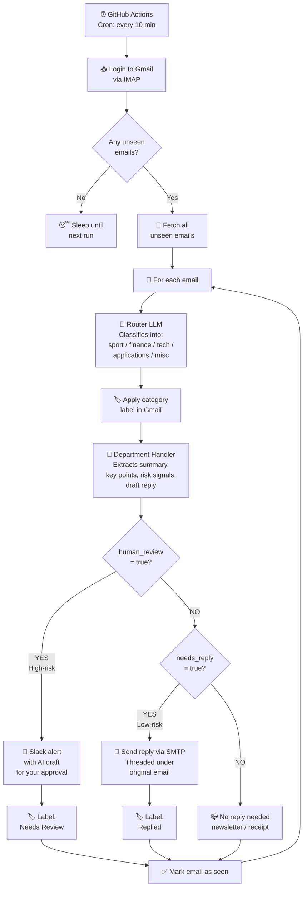

# 📧 Email Router Agent — The AI Receptionist

An autonomous AI receptionist that reads your Gmail, classifies incoming messages into departments, summarizes them, and **intelligently replies on your behalf** — while safely escalating high-risk emails (large invoices, legal notices, security alerts) to Slack for human review.

Runs serverlessly on GitHub Actions. Zero infrastructure. Zero hosting costs.

---

## ✨ Features

- **🧭 Smart Routing** — Mistral-powered classifier sorts every email into `sport`, `finance`, `tech`, `applications`, or `misc`
- **🤖 Department Handlers** — Each category has a specialist analyst prompt (Financial Analyst, Tech/IT Analyst, Sports Desk, etc.) that extracts summaries, key points, and risk signals
- **📨 Auto-Reply with Threading** — For low-risk emails that deserve a response, the agent drafts a **context-aware reply** that reflects the sender's actual message, and sends it via SMTP — properly threaded under the original conversation
- **🛡️ Human-in-the-Loop Escalation** — High-risk emails (>$500 invoices, interview invites, security alerts) are **never** auto-replied. The agent drafts a reply and sends it to Slack for your approval first
- **🏷️ Gmail Labeling** — Every email gets labeled by category and reply status (`Replied` / `Needs Review`) for easy triage
- **⏰ Serverless Cron** — Runs on GitHub Actions every 10 minutes, no server or VPS required

---

## 🏗️ Architecture



---

## ⚖️ The Safety Policy

The agent follows a strict **three-track policy** based on risk — so auto-replies only go out when it's safe:

| Email Type | Trigger | Action |
|---|---|---|
| 🚨 **High-risk** | Large invoice, security alert, interview invite, legal notice | Draft reply → Slack alert for approval → **Do NOT auto-send** 🛡️ |
| ✅ **Low-risk + needs reply** | Simple question, confirmation request, follow-up | Send context-aware reply via SMTP → Label `Replied` |
| 📪 **No reply needed** | Newsletter, receipt, FYI notification | Just label & file → No action |

---

## 🧰 Tech Stack

| Layer | Tool |
|---|---|
| Orchestration | **LangGraph** |
| LLM | **Mistral** |
| Email (read) | **Gmail IMAP** via `imap-tools` |
| Email (send) | **Gmail SMTP** via `smtplib` |
| Notifications | **Slack Webhooks** |
| Deployment | **GitHub Actions** (serverless cron) |
| Language | Python 3.11 |

---

## 🚀 Setup

### 1. Clone the repo
```bash
git clone https://github.com/YOUR_USERNAME/email-router-agent.git
cd email-router-agent
```

### 2. Configure GitHub Secrets
Go to your repo → **Settings → Secrets and variables → Actions** and add:

| Secret | Description |
|---|---|
| `EMAIL` | Your Gmail address |
| `EMAIL_APP_PASSWORD` | [Generate a Gmail App Password](https://myaccount.google.com/apppasswords) |
| `MISTRAL_API_KEY` | From [console.mistral.ai](https://console.mistral.ai) |
| `ESCALATION_WEBHOOK` | Slack Incoming Webhook URL for high-risk alerts |

### 3. Install locally (for testing)
```bash
pip install langchain-mistralai imap-tools requests python-dotenv
```

### 4. Run locally
```bash
python mail_reader.py
```

---

## 📬 Example Flows

### ✅ Auto-Reply (Low-Risk)

**Incoming:** *"Hi Oladapo, can you confirm you received my application?"*

1. Router → `applications`
2. Handler → `human_review=False`, `needs_reply=True`
3. Agent drafts: *"Hi [Name], Yes, I've received your application. I'll review it over the next few days and get back to you by end of week. Thanks for applying!"*
4. SMTP sends reply, **threaded** under the original email
5. Gmail labels: `applications` + `Replied` ✅

### 🛡️ Escalation (High-Risk)

**Incoming:** Invoice for $2,000 from unknown vendor

1. Router → `finance`
2. Handler → `human_review=True` (exceeds $500 threshold)
3. Agent drafts a cautious reply but **does NOT send**
4. Slack alert fired: `🚨 HUMAN REVIEW REQUIRED` with the draft attached
5. Gmail labels: `finance` + `Needs Review`

---

Built with by Oladapo Jolaiya.